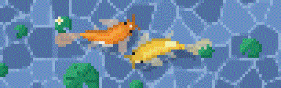

# KOI - In Your Terminal

A procedural pixel-art koi pond for your terminal. Two koi circle each other under drifting lily pads on rippling water, drawn fresh every frame from math. There are no sprites or images. It's a single Go binary with no dependencies, made to run as your fish shell greeting.



## Install

You need Go 1.24 or newer.

```fish
cd koi                         # the folder with main.go and go.mod
go build -o ~/.local/bin/koi .
fish_add_path ~/.local/bin     # only if it isn't on your PATH yet
```

Try it:

```fish
koi
```

## Options

| Flag | Default | What it does |
|---|---|---|
| `-s 8` | `5` | Seconds to animate. You can also set `KOI_SECONDS`. |
| `-loop` | off | Animate until Ctrl-C, like a screensaver. |
| `-w 60` | `$COLUMNS`, max 80 | Pond width in columns. |
| `-h 20` | `16` | Pond height in terminal rows. |
| `-clear` | off | Erase the pond when the animation ends. |
| `-seed 5` | random | Use the same pond layout and koi every time. |
| `-time night` | from clock | Force a time of day: `morning`, `afternoon`, `late-afternoon`, `early-night`, `night`, `late-night`. By default koi reads your system clock, so the pond is pale and pearly in the morning, warm at dusk, dark with a moon reflection after 10pm. |
| `-256` | auto | Force 256-color output. |
| `-frame 2` | | Print a single frame at 2 seconds and exit. |
| `-gif pond.gif` | | Save the animation (`-s` seconds) as a looping GIF, enlarged 4×, and exit. Combine with `-seed`. |
| `-png pond.png` | | Save a frame as a PNG, enlarged 8×, and exit. Combine with `-frame` and `-seed`. |

Some examples:

```fish
set -Ux KOI_SECONDS 8           # swim longer in every new shell
koi -h 22 -w 50                 # a squarer pond
koi -loop                       # screensaver
koi -seed 5 -png preview.png    # regenerate the preview image
```

## Terminal support

- **Colors:** koi uses 24-bit color when `$COLORTERM` is `truecolor` or `24bit`, which covers iTerm2, kitty, WezTerm, Alacritty, Ghostty, GNOME Terminal and Windows Terminal. Elsewhere it falls back to 256 colors, which look a bit coarser. macOS Terminal.app only supports 256 colors.
- **Font:** the pixels are drawn with the half-block character `▀`, so your font needs to include it. Almost every monospace font does.
- **Quiet when it should be:** koi does nothing when output isn't a terminal (pipes, scripts, `scp`) or when `NO_COLOR` is set.

## How it works

Each terminal cell shows two square pixels. The top pixel is the character color of `▀` and the bottom pixel is its background color. Each frame is drawn in this order:

1. **Water.** The pond is split into irregular cells, each a slightly different blue. Pale caustic lines run along the borders where the cells meet, and the cells drift slowly.
2. **Shadows.** Each koi casts a darker copy of its body onto the water, offset down and to the right.
3. **Koi.** Each fish is a spine of points that trails along a figure-eight path, with a wave traveling down it so the tail swings more than the head. A pixel belongs to the body when it is closer to the spine than the body's width at that point (a distance field). That's why the whole body bends naturally. Shading, color patches, eyes, whiskers, flapping fins and the translucent tail are all computed from the pixel's position along and across the body.
4. **Lily pads.** Notched circles with veins and the occasional flower. They're drawn last because they float on the surface, so the koi pass underneath.

The finished pixel grid is converted to `▀` characters with ANSI color codes. The program moves the cursor back up and redraws in place 24 times a second, so your scrollback stays clean.

## Customizing

All the main settings are in `main.go`:

- **`varieties`:** the koi color schemes. Add your own with a base color, a patch color, a highlight color and a patch threshold (higher means fewer patches). Built in: kohaku, orenji, tancho, showa and yamabuki.
- **`palettes` in `palette.go`:** the six time-of-day palettes (water tones, caustic colors + amplitude, sky-glow, lily-pad tones, moon flag). The right one is picked from your clock at startup, or forced with `-time`.
- **`newScene`:** fish size (`R`, `seg`, `n`), swimming speed and the size of the figure-eight.
- **`spine`:** `t*7` sets how fast the tail beats.
- **`makePads`:** how many lily pads there are and how big they get.
